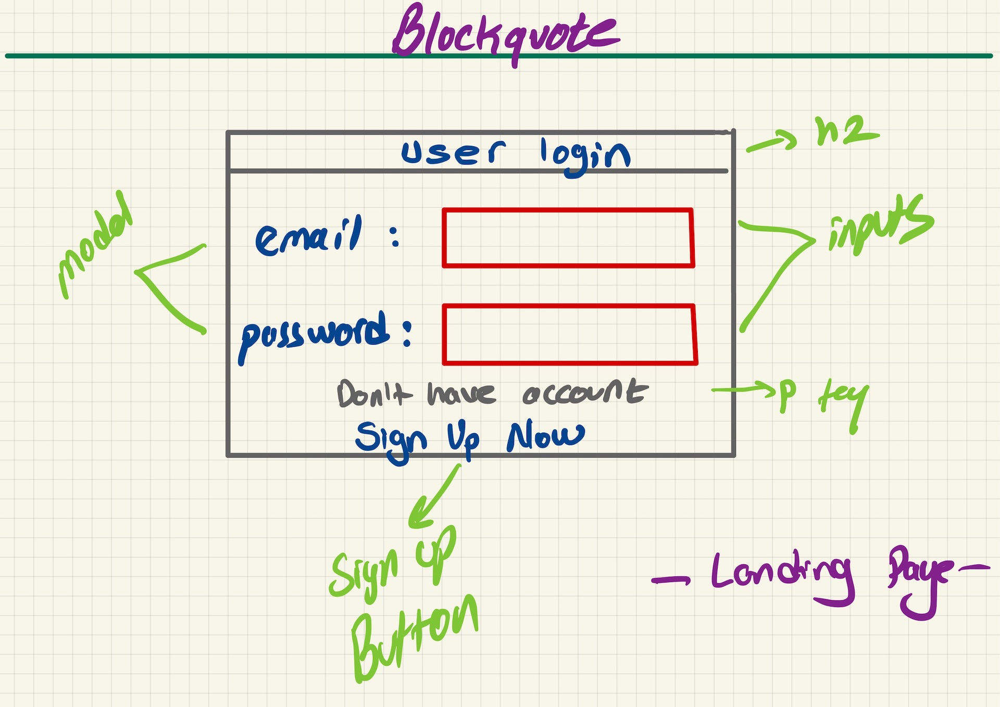

 <h1>Blockquote</h1>

Blockquote is a blog compose webpage where users can compose their articles based on what kind of random quotes will be generated by API. When users decide to write an article, they will be inspired by random quotes that will be provided once they create new articles. User articles will be secured with encryption technology and would not get any threat by any malicious third-parties.

API:<h2><a href="https://api.quotable.io/random?maxLength=50#">Quotable</a></h2>

Wireframes

ERD

## _Restful Routing Chart_

| VERB | URL pattern | Action \(CRUD\) | Description |
| :--- | :--- | :--- | :--- |
| GET | /compose | Index \(Read\) | lists all posts |
| GET | /compose | New \(Read\) | shows a form to make a new compose |
| POST| /compose | Create \(Create\) | creates an compose with the payload\(form\) data |
| GET | /compose/:id | Show \(Read\) | list information about a specific compose |
| GET | /compose/edit/:id | Edit \(Read\) | shows a form for editing a specific compose |
| PUT | /compose/:id | Update \(Update\) | updates the data for a specific compose \(i.e. /compose/1\) |
| PUT | /compose/:postId/comments/:commentId | Update \(Update\) | updates the data for a specific comment \(i.e. /compose/1/comments/2\) |
| DELETE | /compose/:id | Destroy \(Delete\) | deletes the compose with the specified id \(i.e. /compose/1\) |
| DELETE | /compose/:postId/comments/:commentId | Destroy \(Delete\) | deletes the comment with the specified id \(i.e. /compose/1/comments/2\) |

## _MVP Goals_

- As a user, I want to be able to log in to the Blockquote
- As a user, I want to be able to sign up to the Blockquote
- As a user, I want to be able log out from the app
- As a user, I want to be able to create a new compose in the posts page
- As a user, I want to be able see all posts in the homepage
- As a user, I want to be able to navigate through webpages
- As a user, I want to be able to edit and delete the compose

## _Stretch Goals_

- As a user, I want to be able to see comments
- As a user, I want to be able to make comments
- As a user, I want to be able to edit and delete comments

 

## _Technologies Used_

<!--  -->

## _Resources_
